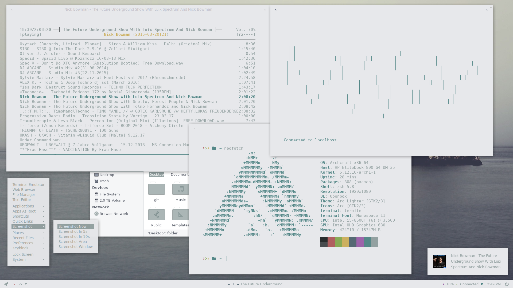

# archcraft-mods

NOTE: Archcraft seems to be bloating out a bit. These mods are earlier versions of iso and some modifications may be required for everything to work on later isos. i.e. this openbox menu still uses termite

REMEMBER TO
- install nerd-fonts-isoveka
- run fix modules
- fix time	- 'timedatectl set-ntp true'	- 'hwclock --systohc'

archcraft styling  mods
 - basically a rehash of the archcraft's beach style but lightened up a lot. 
 
   - Openbox
   - Rofi
   - Polybar
   - Mpd
   - Ncmpcpp
 
 - maybe throw in a custom startpage styled along the same lines - Startpage made into a separate private repository due to PI ( I styled it along these lines https://github.com/grtcdr/startpages so credit due to that guy)
 
To the Archcraft guy - great work  https://github.com/adi1090x  https://github.com/archcraft-os

25_01_21 Remember to install nerd-fonts-isoveka and run fix modules

06_03_21 Update preserving hiddens and executables 

21_03_21 - add Arc_lighter window theme and Arc icon theme (colours modded to #93a1a1)
				- a few other minor colour tweaks (#93a1a1)
				
01_06_21 - update for new iso/github sturucture -add gtk3 setings.ini

23_06_21 - there's a tweak in here to make workspaces more noticeable (swap fg/bg for current workspace and used workspaces are now coloured red)

06_07_21 add .config/gtk-3.0/gtk.css for terminal internal padding
